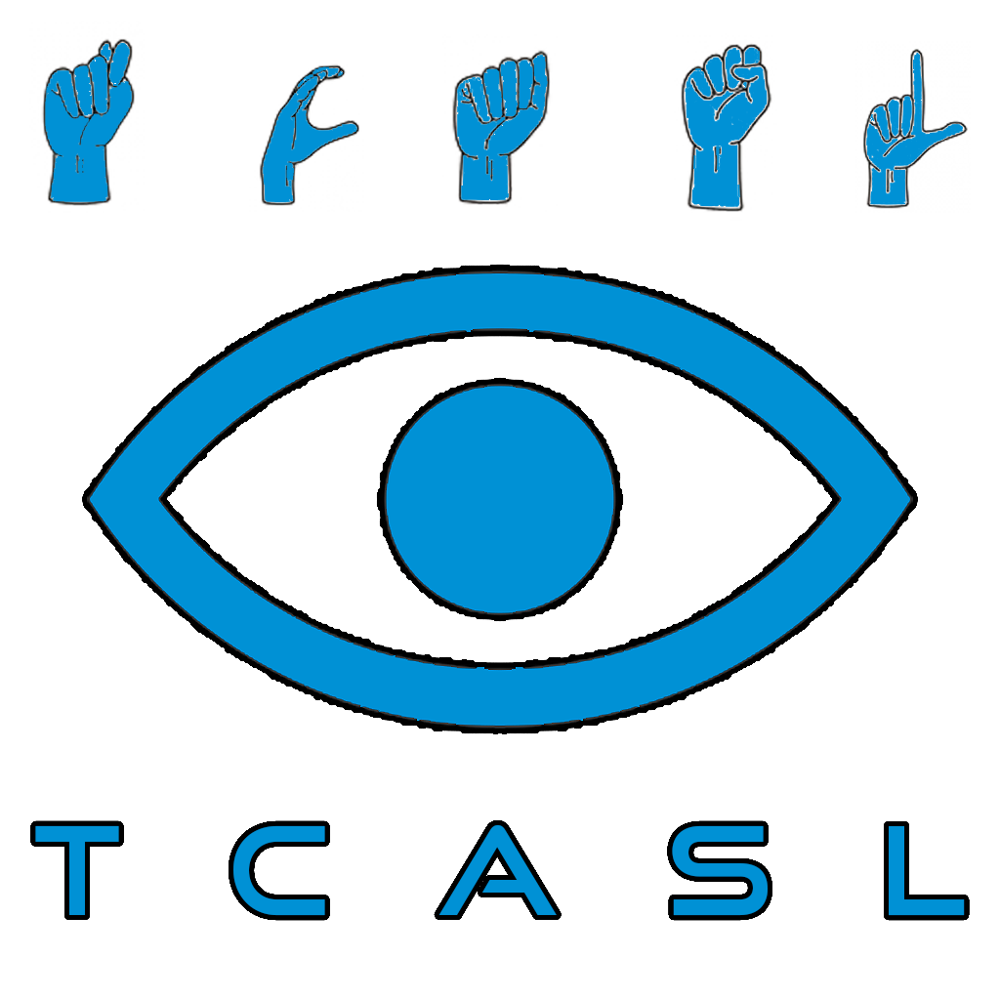

# TCASL
*Real-time American Sign Language recognition via temporal contrast emulation.*

## Table of Contents
1. [Background](#background)
2. [Getting Started](#getting-started)
   - [App (TCASLApp)](#app-tcaslapp)
   - [Pip Library (TCASLCore)](#pip-library-tcaslcore)
   - [Dataset (HuggingFace)](#dataset-huggingface)
3. [Known Limitations](#known-limitations)

## Background

Millions of people rely on sign language to communicate, yet real-time translation tools typically demand expensive hardware or high-end GPUs. TCASL addresses this by mimicking Dynamic Vision Sensors (DVS) in software, using temporal contrast emulation to isolate hand motion from standard webcam video and discard static background noise. The resulting sparse event frames are classified by a Spiking Deep Neural Network (SDNN), enabling real-time ASL finger-spelling recognition on consumer hardware.

📄 **[Read the paper (PDF)](TCASL.pdf)**

## Getting Started

### App (TCASLApp)
A gamified finger-spelling application (Spelling Bee format) that uses your webcam to validate ASL gestures in real time across three difficulty levels.

For setup and usage, see the [TCASLApp README](https://github.com/keshavshankar08/TCASL/blob/main/TCASLApp/README.md).

### Pip Library (TCASLCore)
A lightweight Python library for integrating temporal contrast emulation and SDNN inference into your own projects.

For setup and usage, see the [TCASLCore README](https://github.com/keshavshankar08/TCASL/blob/main/TCASLCore/README.md).

### Dataset (HuggingFace)
To access our custom dataset, see our [HuggingFace](https://huggingface.co/datasets/keshavshankar/TCASL) page for instructions!

## Known Limitations

- **Lighting:** Temporal contrast emulation detects pixel-level intensity changes, so flickering lights or moving shadows can generate false events and degrade accuracy.
- **Hand speed:** Signing too slowly produces an event frame too sparse to classify reliably; signing too quickly causes motion blur.
- **Dynamic gestures (J and Z):** The current pipeline classifies static frames, so only the final hand position of motion-based letters is captured.
